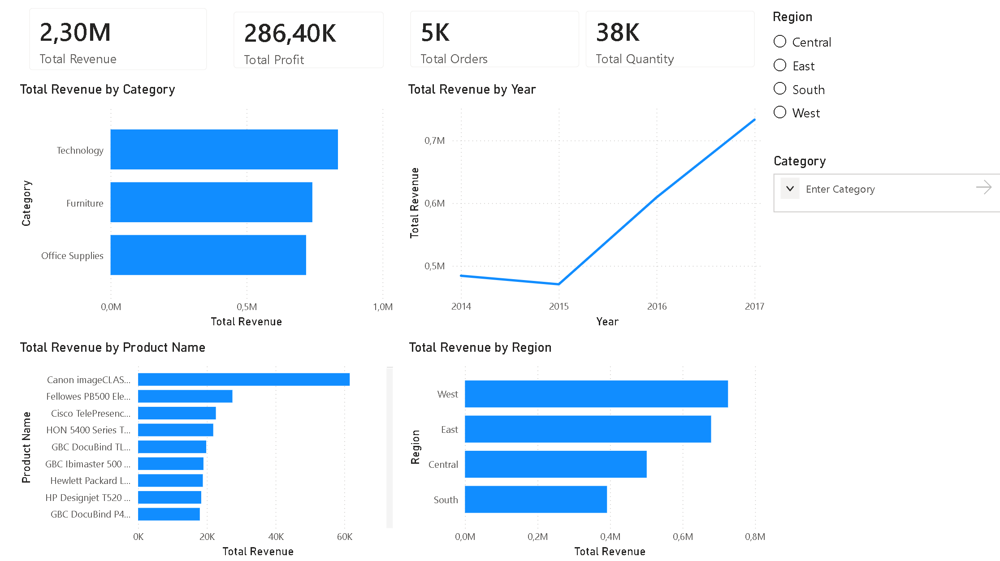

# Business Sales Performance Analytics

End-to-End Data Analytics Project

---

## Overview
This project analyzes retail sales data to uncover insights into revenue trends, product performance, and regional profitability.

---

## Dashboard Preview

---

## Objectives
- Identify top-performing products  
- Analyze sales trends over time  
- Evaluate category and regional performance  
- Provide business recommendations  

---

## Tools Used
- Power BI  
- Excel  
- Data Cleaning & Visualization  

---

## Key Insights
- Technology category generates the highest revenue  
- Sales increased significantly after 2015  
- West region performs the best  
- Some products have low profitability  

---

## Recommendations
- Focus on high-profit categories  
- Improve low-performing regions (South)  
- Optimize pricing strategy  
- Prepare for seasonal sales spikes  

---

## Files Included
- `Business_Sales_Dashboard.pbix` – Dashboard file  
- `Sample - Superstore.csv` – Dataset  
- `Dashboard.png` – Dashboard image  
